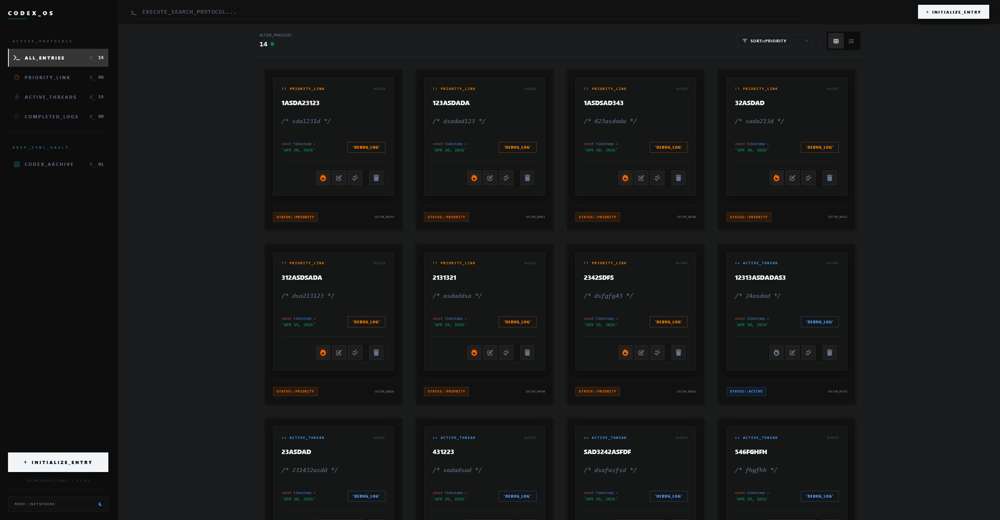
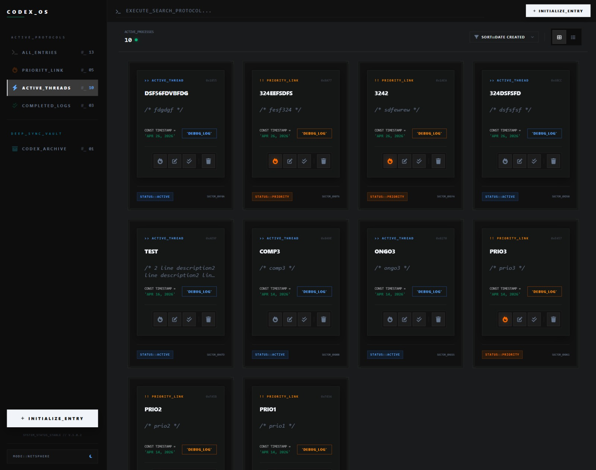
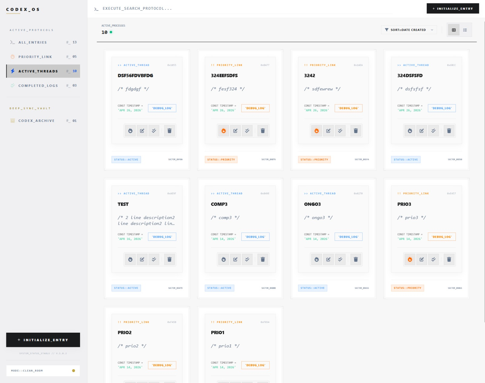
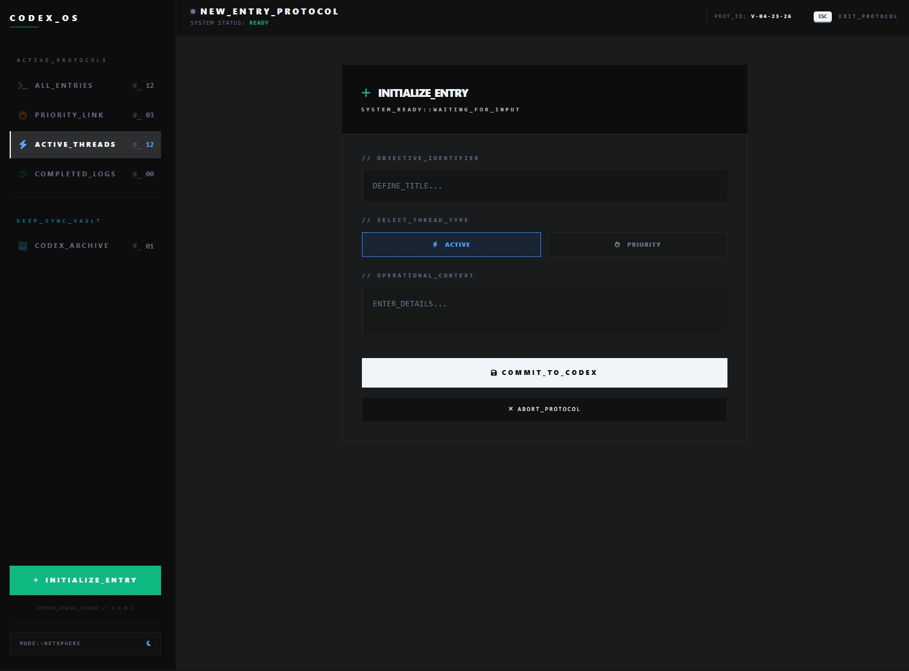
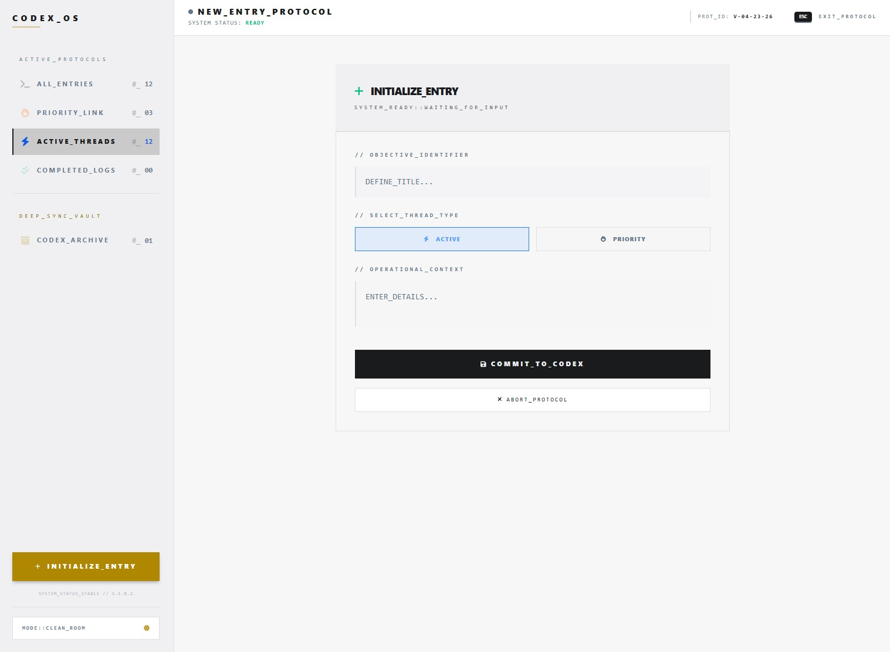
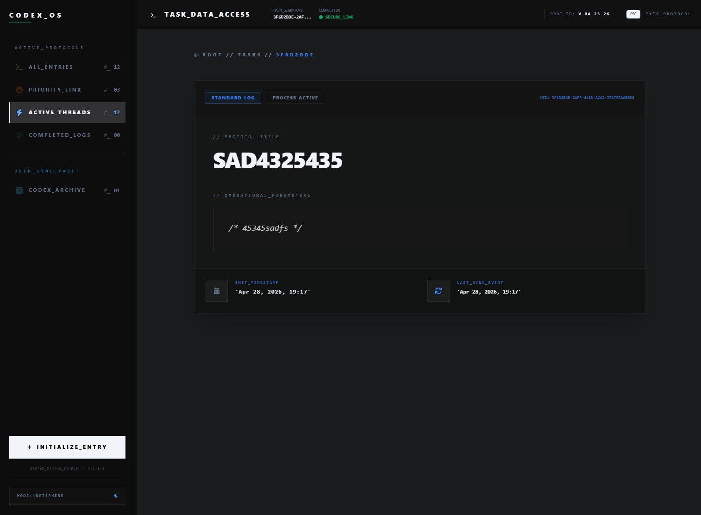
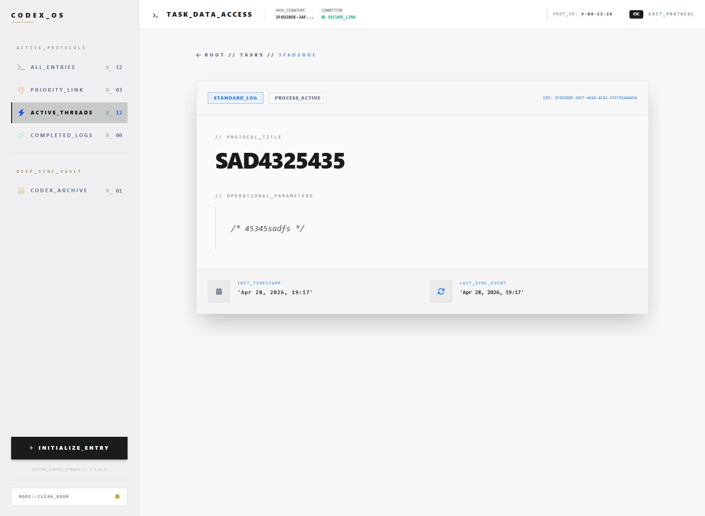

# React Task Management Dashboard

A terminal-inspired high-performance, responsive Task Management application built with **React 18**, **TypeScript**, and **Vite**. This project demonstrates modern frontend patterns, type-safe state management, and a clean, accessible UI.

**🚀 Live Demo**: [View on Vercel](https://codex-os-task-manager.vercel.app/)










---

## 🛠 Tech Stack

- **Core**: React 18.3 (Hooks, Functional Components)
- **Routing**: React Router DOM
- **State Management**: Context API + useReducer
- **Language**: TypeScript (Strict Mode)
- **Build Tool**: Vite (Fast HMR)
- **Deployment**: Vercel
- **Styling**: Tailwind CSS + CSS variables
- **Linting**: ESLint + Prettier (Production-ready config)

---

## ✨ Features

- **Dynamic Task Management**: Add, complete, and delete tasks with real-time UI updates.
- **Persistent State**: Persistent State: Uses localStorage to preserve tasks, theme, sorting, and view preferences across refreshes.
- **Responsive Design**: Optimized for mobile, tablet, and desktop viewports.
- **Type Safety**: End-to-end TypeScript implementation to minimize runtime errors.
- **Fast Refresh**: Optimized development experience using Vite's HMR.

---

## 🏗 Project Structure

```text
src/
├── assets/          # Static resources, if any
├── components/      # Reusable UI components
├── contexts/        # TasksContext, ThemeContext
├── hooks/           # Custom hooks like useSystemEscape
├── pages/           # Home, TaskDetails
├── App.tsx          # Router + providers
├── main.tsx         # React entry point
└── index.css        # Global styles + theme variables
```

---

## ⚡ Getting Started

**Prerequisites**

- Node.js (v20 or higher)
- npm or pnpm

---

## ⚙️ Installation

```bash
git clone https://github.com/Vacilli/React-To_Do-List.git
cd React-To_Do-List
```

---

## 💾 Install Dependencies

```bash
npm install
```

---

## 🖥️ Run Development Server

```bash
npm run dev
```

---

## 🔨 Future Improvements

- Next.js migration
- Calendar integration
- Notification system
- Enhanced mobile interactions
- Expanded settings system
